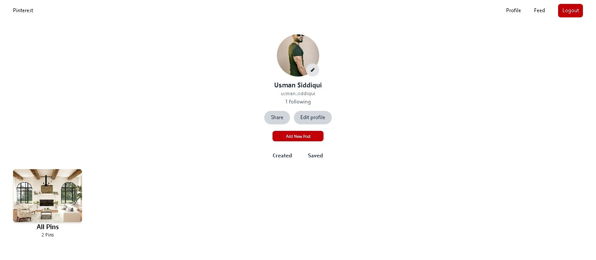
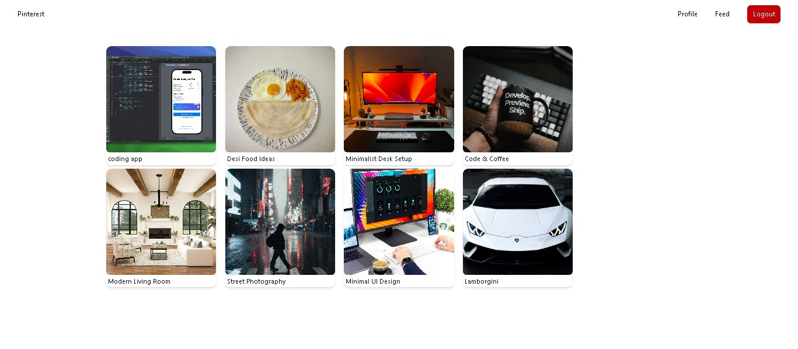

# 📌 Pinterest Clone

A Pinterest-like image sharing app.

## 🚀 Features

- User registration & login (session-based authentication)
- Upload profile picture
- Create posts with image, title, and description

## 📷 Screenshots

## 🛠️ Tech Stack

- **Frontend:** EJS + Tailwind CSS
- **Backend:** Node.js, Express.js
- **Database:** MongoDB (Mongoose)
- **Authentication:** Passport.js (Local Strategy)
- **File Uploads:** Multer

## 🔗 Live Demo

[Click here to view](https://your-demo-link.com)

## 📸 Usage

1. Register or login to your account
2. Upload a profile picture
3. Create and share posts
